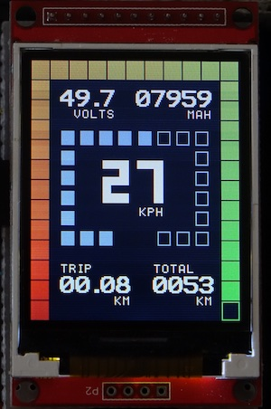

DAVEga (The VEsc GAdget), or Dave for short, is a device for displaying data read from a [VESC](https://www.vesc-project.com/) based controller, such as speed, remaining battery capacity, and travelled distance. It was originally named VeGa, but was later re-branded due to the insistence of the e-skate lobby ([[1]](https://www.electric-skateboard.builders/t/vega-battery-monitor-odometer-speedometer/71509/8?u=janpom), [[2]](https://www.electric-skateboard.builders/t/vega-battery-monitor-odometer-speedometer/71509/130?u=janpom), [[3]](https://www.electric-skateboard.builders/t/vega-battery-monitor-odometer-speedometer/71509/145?u=janpom)).

This repository contains the DAVEga firmware. The schematics and gerber files can be obtained from [EasyEDA](https://easyeda.com/honza.pomikalek/VESC-Gauge).

## Main features

- speedometer
- odometer
  - current trip
  - total traveled distance
- remaining battery capacity
  - battery voltage
  - battery amp-hours remaining
- VESC fault codes
- metric or imperial units
- Arduino compatible FW
- low HW cost (~$10)
- works with the latest VESC FW (v3.40)
  - previous versions not tested but should work as well unless too old

## Configuring and installing firmware

The firmware has to be configured for a particular e-skate. At the very least, the information about the wheel size, gearing, and the battery pack has to be provided.

1. Download the code and open it in the [Arduino IDE](https://www.arduino.cc/en/Main/Software). 
2. Open the [davega.ino](davega.ino) file and customize the options in the CONFIG section.
3. Connect DAVEga to your computer using a USB-UART adapter. Make sure you have drivers for the adapter installed. The DIY kit comes with the [CP2102](https://www.silabs.com/products/development-tools/software/usb-to-uart-bridge-vcp-drivers) based adapter.
4. Under Tools, select:
   - Board: Arduino Nano
   - Processor: ATmega328P
   - Port: the port to which the USB-UART is connected (e.g. `/dev/cu.SLAB_USBtoUART` for CP2102 adapter on a Mac)
5. Upload.

## License

DAVEga firmware and hardware design is released under [GNU GPL v3](LICENSE).

## Links

- [DAVEga video presentation](https://youtu.be/u4e83JhVZNA)
- [DAVEga thread at esk8 builders forum](https://www.electric-skateboard.builders/t/davega-battery-monitor-odometer-speedometer/71509)
- [VESC project](https://www.vesc-project.com/)
