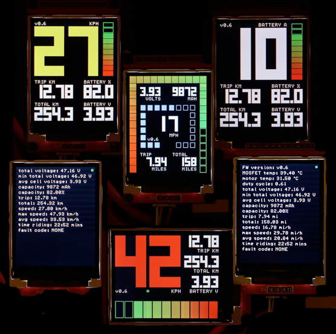

DAVEga (The VEsc GAuge/GAdget), or Dave for short, displays speed, battery capacity, traveled distance and other useful info retrieved from a [VESC](https://www.vesc-project.com/) based controller.

This repository contains the DAVEga firmware. The gerber files can be downloaded from the [gerbers](gerbers/) directory or from [EasyEDA](https://easyeda.com/honza.pomikalek/VESC-Gauge).

There's a story behind the name, but it's a long one. It all started on [esk8 builders](https://www.electric-skateboard.builders/t/davega-battery-monitor-odometer-speedometer/71509). Here's some [highlights](https://drive.google.com/open?id=1wQXwRZDEmFR0n38wdO90uCEpWIoIBl2a) from the discussion.

## Main features

- speedometer
- odometer
  - current trip
  - total traveled distance
- remaining battery capacity
  - battery voltage
  - battery amp-hours remaining
- VESC fault codes
- metric or imperial units
- Arduino compatible FW
- low HW cost (~$10)
- known to work well with the VESC FW v3.48 and v3.40
  - previous versions not tested but should work as well unless too old
- FOCBOX Unity supported

## Configuring and installing firmware

The firmware has to be configured for a particular e-skate. At the very least, the information about the wheel size, gearing, and the battery pack has to be provided.

1. Open the [Arduino IDE](https://www.arduino.cc/en/Main/Software).
2. Install the TFT_22_ILI9225 library.
   - Go to [https://github.com/Nkawu/TFT_22_ILI9225](https://github.com/Nkawu/TFT_22_ILI9225) and do `Clone or download > Download ZIP`.
   - Open the Arduino IDE and do `Sketch > Include Library > Add ZIP file...` Then select the downloaded ZIP file.  
3. Download DAVEga firmware from [releases](https://github.com/janpom/davega/releases) and unzip to your Arduino project directory (typically `$HOME/Documents/Arduino/`).
3. Open the [davega.ino](davega.ino) from Arduino IDE to load the project.
4. Go to the [davega_config.h](davega_config.h) tab and adjust the configuration to your needs.
5. Connect DAVEga to your computer using a USB-UART adapter. Make sure you have drivers for the adapter installed. The DIY kit comes with the [CP2102](https://www.silabs.com/products/development-tools/software/usb-to-uart-bridge-vcp-drivers) based adapter.
6. Under Tools, select:
   - Board: Arduino Nano
   - Processor: ATmega328P
   - Port: the port to which the USB-UART is connected (e.g. `/dev/cu.SLAB_USBtoUART` for CP2102 adapter on a Mac)
7. Upload.

## Configuring the ESC

In the [VESC Tool](https://vesc-project.com/vesc_tool) set:

1. App Settings > General > App to Use: **PPM and UART**
2. App Settings > UART > Baudrate: **115200 bps**

## License

DAVEga firmware and hardware design is released under [GNU GPL v3](LICENSE).

## Enclosures

3D-printable DAVEga enclosures are available on the [Thingiverse](https://thingiverse.com/).
- [by @mmaner (v2)](https://www.thingiverse.com/thing:3218890)
- [by @mmaner (v3)](https://www.thingiverse.com/thing:3274207)
- [by @lrdesigns](https://www.thingiverse.com/thing:3171000)
- [by @JonathanLau1983](https://www.thingiverse.com/thing:3248802)

## Links

- [DAVEga video presentation](https://youtu.be/u4e83JhVZNA) (first prototype)
- [DAVEga thread at esk8 builders forum](https://www.electric-skateboard.builders/t/davega-battery-monitor-odometer-speedometer/71509)
- [DAVEga assembly video](https://youtu.be/QPjD0Zebh9U)
- DAVEga cable tips:
  - [Making a basic cable](https://www.electric-skateboard.builders/t/davega-battery-monitor-odometer-speedometer/71509/1302?u=janpom)
  - [Making an advanced cable](https://www.electric-skateboard.builders/t/davega-battery-monitor-odometer-speedometer/71509/726?u=janpom)
  - [Misc cable ideas](https://www.electric-skateboard.builders/t/davega-battery-monitor-odometer-speedometer/71509/293?u=janpom)
- [DAVEga on Arduino Nano](https://www.electric-skateboard.builders/t/davega-battery-monitor-odometer-speedometer/71509/209?u=janpom)
- [DAVEga coding crash course](https://www.electric-skateboard.builders/t/davega-battery-monitor-odometer-speedometer/71509/1249?u=janpom)
- [DAVEga kits for purchase](https://www.electric-skateboard.builders/t/davega-second-batch/82070)
- [DAVEga SLA printed case for purchase](https://www.electric-skateboard.builders/t/davega-lrdesigns-sla-printed-case/82435)
- DAVEga 2.0" display purchase links
  - [AliExpress](https://www.aliexpress.com/item/ILI9225-2-0-Inch-UART-TFT-LCD-Display-Module-SPI-Interface-Colorful-Screen-Serial-Port-176x220/32792711665.html) (verified seller)
  - [Amazon](https://www.amazon.com/Display-176x220-ILI9225-Peripheral-Interface/dp/B07HF7WVST) (faster delivery but more expensive)
- [VESC project](https://www.vesc-project.com/)
